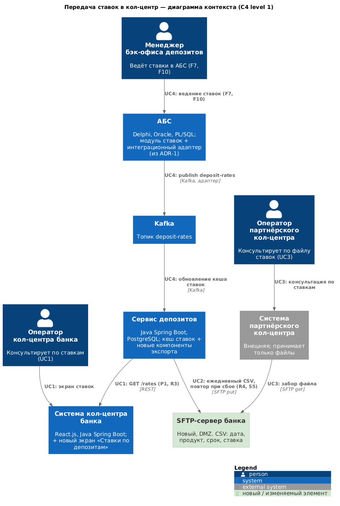
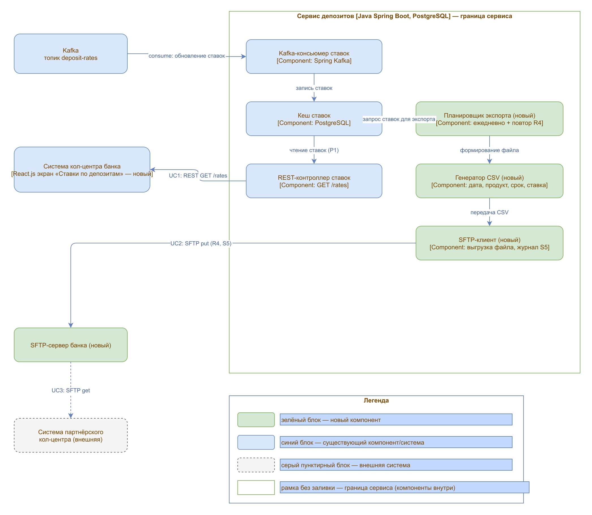
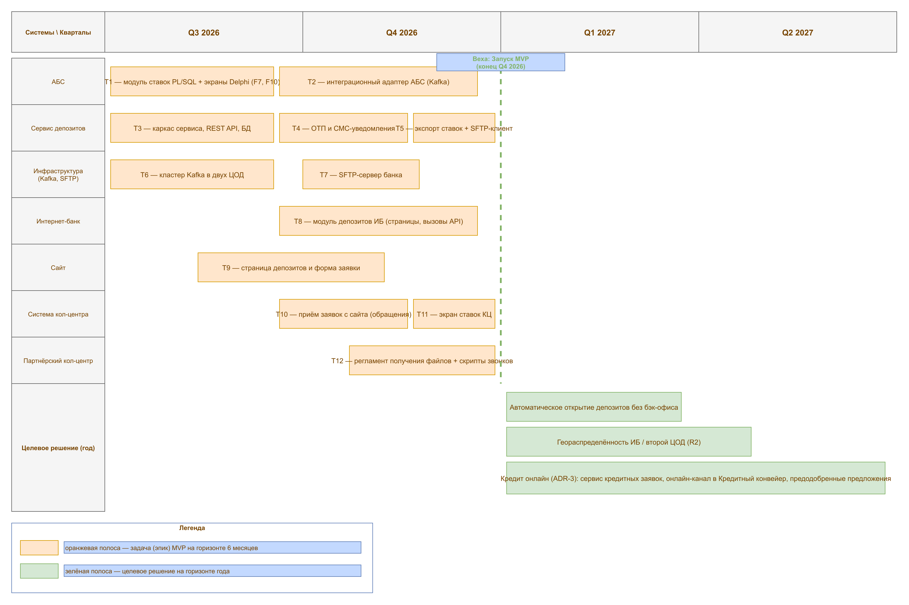

### **Название задачи:** ADR-2. Передача ставок по депозитам в кол-центр и партнёрский кол-центр

### **Автор:** Иван Щербаков

### **Дата:** 19.07.2026

### **Функциональные требования**

Большинство клиентов банка «Стандарт» — пожилые люди. После запуска маркетинговой кампании ожидается рост звонков: возрастным клиентам сложно ориентироваться в новых онлайн-процессах, и они будут уточнять условия депозитов по телефону. Чтобы разгрузить кол-центр банка, привлекается партнёрский кол-центр. Операторам обоих кол-центров нужен доступ к актуальным ставкам по депозитам. Решение опирается на архитектуру MVP из ADR-1 (Сервис депозитов и модуль ставок АБС) и требования из `Task2/furps.md`. Верхнеуровневые Use Cases:

|**№**|**Действующие лица или системы**|**Use Case**|**Описание**|
| :-: | :- | :- | :- |
| UC1 | Оператор КЦ, Система КЦ, Сервис депозитов | Консультация по ставкам в кол-центре банка (F7) | Оператор открывает новый экран «Ставки по депозитам» в системе КЦ; система КЦ получает актуальные ставки REST-запросом `GET /rates` к API Сервиса депозитов (чтение из кеша — P1). |
| UC2 | Сервис депозитов, SFTP-сервер банка | Ежедневная выгрузка ставок для партнёра (F7) | Планировщик Сервиса депозитов после ежедневного обновления ставок формирует CSV-файл (дата, продукт, срок, ставка) и выкладывает его на SFTP-сервер банка; при сбое выгрузка повторяется (R4). |
| UC3 | Оператор партнёрского КЦ, Система партнёрского КЦ, SFTP-сервер банка | Консультация в партнёрском кол-центре (F7) | Система партнёрского КЦ забирает CSV-файл с SFTP-сервера банка; оператор партнёра консультирует клиента по актуальным ставкам. |
| UC4 | Менеджер бэк-офиса, АБС, Интеграционный адаптер АБС, Kafka, Сервис депозитов | Актуализация ставок (F7, F10) | Ставки изменены в модуле АБС (из ADR-1) → адаптер АБС публикует их в Kafka `deposit-rates` → кеш Сервиса депозитов обновлён → новые ставки доступны кол-центру (UC1) и попадают в следующий файл выгрузки (UC2). |

### **Нефункциональные требования**

|**№**|**Требование**|
| :-: | :- |
| R1 | Консультации по ставкам доступны 24/7 (99,9%). |
| R3 | Кол-центры не работают с API/БД АБС напрямую — только через Сервис депозитов и файловый обмен. |
| R4 | Гарантированное формирование и доставка файла ставок: контроль успешной выгрузки и повтор при сбое. |
| P1 | Мгновенный отклик экрана ставок — чтение из кеша Сервиса депозитов. |
| P2 | Горизонтальное масштабирование Сервиса депозитов при росте нагрузки от кол-центров. |
| S1 | Файловый экспорт и SFTP реализуются на уже используемом стеке (Java Spring Boot). |
| S5 | Журналирование выгрузок ставок (кто/когда/какой файл) для аудита. |
| F10 | В кол-центры передаются только публичные текущие ставки — без кредитных данных и персональных ставок. |
| +R6 | Доработку системы КЦ выполняет команда сопровождения подрядчика или Java-специалисты банка; объём доработок минимален. |

Дополнительное ограничение из задания: система партнёрского кол-центра — внешняя, может принимать только файлы (SFTP); прямые API-вызовы к ней невозможны.

### **Решение**

**Диаграммы C4:**

*Рисунок 1. C4 level 1, контекст. Показывает только релевантное текущим изменениям: ведение ставок в АБС → адаптер → Kafka `deposit-rates` → Сервис депозитов; далее REST в систему КЦ банка и файловая выгрузка на новый SFTP-сервер банка, откуда система партнёрского КЦ забирает файл.*

*Рисунок 2. C4 level 3, компоненты Сервиса депозитов, задействованные в передаче ставок: REST-контроллер ставок, кеш ставок (PostgreSQL), Kafka-консьюмер ставок и новые компоненты — Планировщик экспорта, Генератор CSV и SFTP-клиент.*

Исходники диаграмм (PlantUML): `c4-context-rates.puml`, `c4-component-rates.puml`.

**Логика принятия решений:**

1. **Ставки для кол-центра банка — через REST.** В системе КЦ добавляется новый экран «Ставки по депозитам» (React.js), который делает REST-запрос `GET /rates` к Сервису депозитов. Кол-центр не получает доступ к АБС (R3), читает из кеша (P1). Доработку экрана выполняет подрядчик КЦ или Java-специалисты банка (+R6) — объём минимален, поэтому REST предпочтительнее прямого чтения Kafka.
2. **Ставки для партнёра — через файловый обмен.** Партнёрская система умеет только принимать файлы, поэтому в Сервис депозитов добавляются компоненты: «Планировщик экспорта ставок» (ежедневный запуск по расписанию с повтором при ошибке — R4), «Генератор CSV» (формат: дата, продукт, срок, ставка) и «SFTP-клиент». Разворачивается SFTP-сервер банка в DMZ; партнёр забирает файл сам (pull). Разрабатывает команда Сервиса депозитов; SFTP-сервер — команда инфраструктуры IT.
3. **Единый источник ставок.** Ставки по-прежнему ведутся в АБС (F7, из ADR-1) и распространяются через Kafka `deposit-rates` в кеш Сервиса депозитов — единая точка выдачи для сайта, ИБ (ADR-1) и обоих кол-центров. В кол-центры уходят только публичные ставки без персональных и кредитных данных (F10).
4. **Аудит.** Все выгрузки журналируются (S5): фиксируются время, состав файла и результат передачи.

### **Альтернативы**

1. **Система КЦ читает топик Kafka `deposit-rates` напрямую.** Отклонено: доработка сложнее и дороже при ограниченном ресурсе подрядчика (+R6); REST-интеграция тривиальна и не требует Kafka-клиента в системе КЦ.
2. **Отправка файла ставок партнёру по email.** Отклонено: нет гарантий доставки и аудиторского следа (R4, S5).
3. **Прямой доступ систем кол-центров к БД АБС.** Отклонено: нарушает R3, упирается в +R4 (перегруженная БД АБС) и открывает доступ к непубличным данным (F10).

**Недостатки, ограничения, риски**

- Файловый обмен обеспечивает актуальность «раз в день» — при внутридневном изменении ставок партнёр консультирует по устаревшим данным. Принято бизнесом: ставки обновляются ежедневно.
- SFTP-сервер — новый элемент инфраструктуры: требует сопровождения и мер безопасности (доступ, ротация ключей).
- Актуальность данных у партнёра зависит от дисциплины партнёра (расписание забора файлов) — вне контроля банка.

### **Список крупных задач по системам**

Задачи (эпики) охватывают весь MVP (ADR-1 + ADR-2), так как RoadMap строится на 6 месяцев для всего MVP и определяет последовательность изменений между командами.

|**Система**|**Задачи (эпики)**|
| :- | :- |
| АБС | T1 — модуль ставок PL/SQL и экраны Delphi с разграничением доступа депозиты/кредиты (F7, F10); T2 — интеграционный адаптер АБС (Kafka: заявки, ставки, события статусов). |
| Сервис депозитов (новый) | T3 — каркас сервиса, REST API ставок и заявок, БД PostgreSQL; T4 — ОТП и СМС-уведомления; T5 — экспорт ставок (планировщик, генератор CSV, SFTP-клиент). |
| Инфраструктура | T6 — кластер Kafka в двух ЦОД; T7 — SFTP-сервер банка. |
| Интернет-банк | T8 — модуль депозитов (страницы, вызовы REST API). |
| Сайт | T9 — страница депозитов и форма заявки. |
| Система кол-центра | T10 — приём заявок с сайта (создание обращений); T11 — экран ставок по депозитам. |
| Партнёрский кол-центр (орг.) | T12 — регламент получения файлов с SFTP и скрипты звонков по ставкам. |

*Рисунок 3. RoadMap на горизонте Q3 2026 – Q2 2027: последовательность задач T1–T12 по системам для MVP (ADR-1 + ADR-2) и целевые решения года. Исходник (draw.io): `roadmap.drawio`.*
